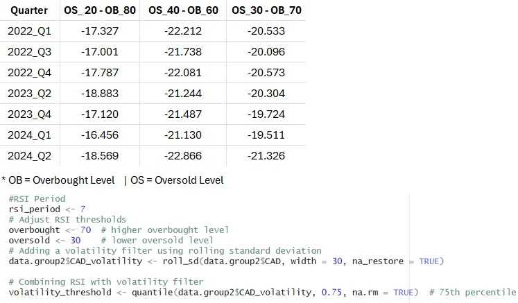
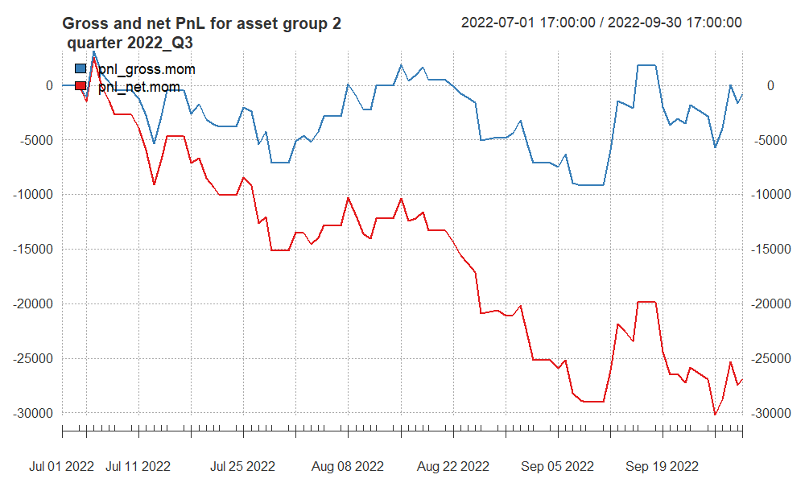
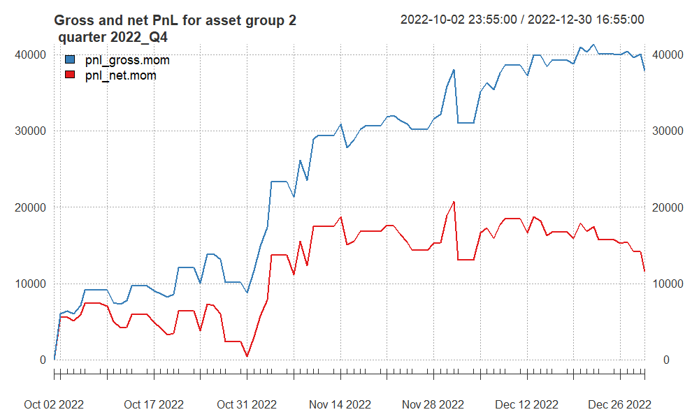
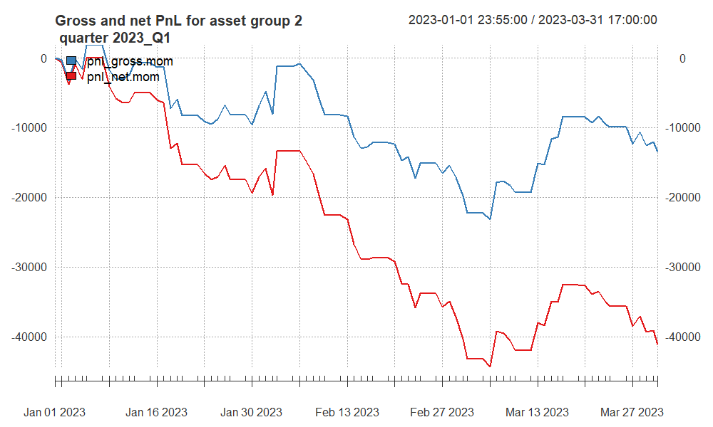
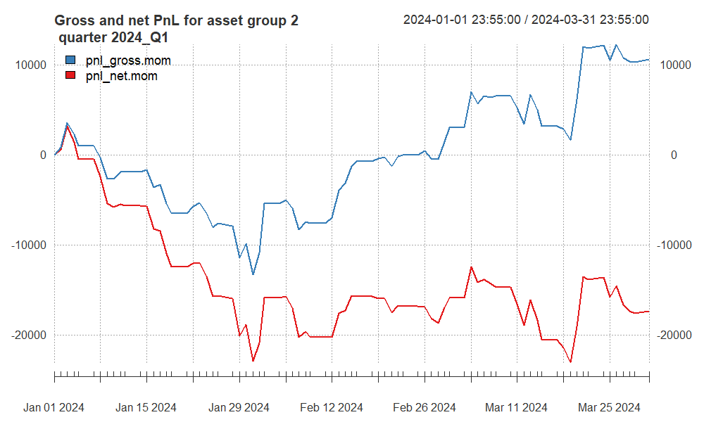
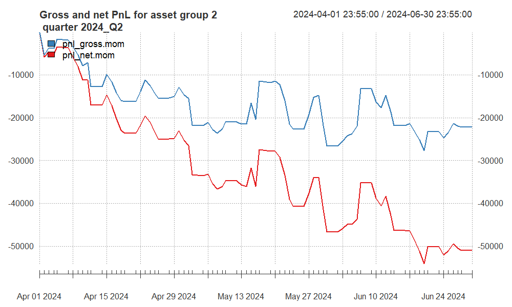
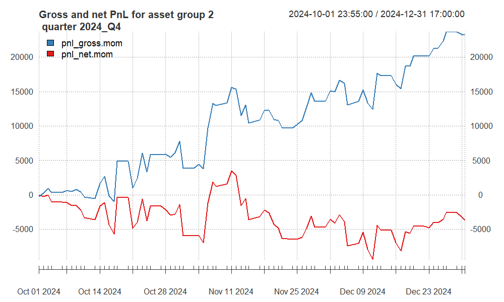

```{r setup, include=FALSE}
# Set global chunk options
knitr::opts_chunk$set(
  echo = TRUE, 
  comment = NA, 
  message = FALSE, 
  warning = FALSE
)

# Load necessary libraries
library(xts)
library(zoo)
library(TTR)
library(lubridate)
library(tseries)       # for maxdrawdown()
library(caTools)       # runsd()
library(RColorBrewer)
library(ggplot2)
library(dplyr)
library(knitr)         # for kable() to show final table
library(kableExtra)    # for enhanced tables

# Suppress the 'dplyr lag()' warning from 'xts' package
options(xts.warn_dplyr_breaks_lag = FALSE)
```
```{r custom functions, echo=FALSE}

# Function to calculate Calmar Ratio
myCalmarRatio <- function(x, scale = 252) {
  cumulative_pnl <- cumsum(x)
  dd_obj <- maxdrawdown(cumulative_pnl)
  if (is.null(dd_obj$maxdrawdown) || dd_obj$maxdrawdown == 0) {
    return(NA)
  }
  return((mean(x, na.rm = TRUE) * scale) / abs(dd_obj$maxdrawdown))
}

# Function to flatten positions outside allowed trading times
flatten_times <- function(pos, allowed_start = "09:55", allowed_end = "15:40") {
  # Force position to 0 if time < allowed_start or time >= allowed_end
  time_ <- format(index(pos), "%H:%M")
  
  # Zero before the allowed start
  pos[time_ < allowed_start] <- 0
  # Zero on or after the allowed end
  pos[time_ >= allowed_end] <- 0
  
  return(pos)
}

source("https://raw.githubusercontent.com/ptwojcik/HFD/master/function_mySR.R")
source("https://raw.githubusercontent.com/ptwojcik/HFD/master/function_positionVB_new.R")
source("https://raw.githubusercontent.com/ptwojcik/HFD/master/functions_plotHeatmap.R")

```

### Introduction

This report presents our final strategy for Group 1 assets – specifically the NQ (NASDAQ futures) and SP (S&P 500 futures) – utilizing out-of-sample intraday data spanning multiple quarters. We employed a Volatility Breakout Momentum approach, with parameters determined through an extensive in-sample analysis. The report includes:
- Detailed strategy assumptions, entry/exit techniques, and parameter values.
- Out-of-sample performance metrics across 5 quarters (2022_Q2, 2023_Q1, 2023_Q3, 2024_Q3, 2024_Q4).
- Tables of Sharpe ratios, Calmar ratios, net/gross PnL, average daily trades, and final summary statistics.
- Cumulative PnL plots based on daily aggregated data for each quarter.


### Final Strategy Selection (Group 1)

#### Volatility Breakout Momentum: Overview

Our final strategy is a Volatility Breakout Momentum approach, characterized by the following steps:
1. **Exponential Moving Averages (EMAs):**
   - Compute a fast EMA (fastEMA) and a slow EMA (slowEMA) on the price series.
2. **Rolling Volatility Measure:**
   - Calculate a rolling standard deviation (runsd) over a specified window (vol_sd).
3. **Signal Generation:**
   - **Long Entry:** When the price exceeds (slowEMA + m_ * rolling_std).
   - **Short Entry:** When the price falls below (slowEMA - m_ * rolling_std).
4. **Position Flattening:**
   - **Post-Processing:** After generating raw positions, enforce position flattening outside the active trading window (09:55–15:40) by setting positions to 0.

### Parameter Search

We explored the following parameter ranges to identify the optimal combination:
- fast_ema: 10, 20, 30
- slow_ema: 60, 75, 90
- vol_sd: 30, 60, 90
- m_: 1.0, 1.5, 2.0

Each combination was evaluated across 7 in-sample quarters using the net Calmar ratio and a custom statistic:
[
\text{stat} = \text{netCR} \times \max(0, \log(|\text{netPnL}| / 1000)).
]

The parameter set that maximized stat was selected for both NQ and SP:
- **NQ:** fastEMA=20, slowEMA=60, vol_sd=60, m_=2
- **SP:** fastEMA=30, slowEMA=60, vol_sd=60, m_=2

These parameters were then held fixed and applied uniformly to all out-of-sample quarters.

### Common Assumptions (Group 1)
- **Time Filtering:**
  - **Excluded Times:**
    - **Morning:** 09:31–09:40
    - **Afternoon:** 15:51–16:00
  - These periods are set to NA to exclude from calculations.
  - **Active Trading Window:** 09:55–15:40
- **Transaction Costs:**
  - $12 per contract change.
- **Position Sizing:**
  - One Unit: Long or short for each NQ and SP.
- **PnL Calculation:**
  - **Combined Daily PnL:** Sum of daily PnL from NQ and SP.

### Results for Group 1 (NQ & SP)

#### In-Sample Performance (5 Quarters)

We applied the selected parameters to the in-sample quarters ("2022_Q1", "2022_Q3", "2022_Q4", "2023_Q2", "2023_Q4", "2024_Q1", "2024_Q2"). The table below summarizes those results:

```{r in-sample-table, echo=FALSE}
# Initialize results_table for Out-of-Sample Data

param_NQ <- list(fast_ema = 20, slow_ema = 60, vol_sd = 60, m_ = 2)
param_SP <- list(fast_ema = 30, slow_ema = 60, vol_sd = 60, m_ = 2)

contract_multiplier_NQ <- 20
contract_multiplier_SP <- 50
transaction_cost       <- 12.0
scale_annual           <- 252  # Approx number of trading days in a quarter
# Initialize a list to store daily_net for plotting
oos_pnl_list <- list()

results_table <- data.frame(
  quarter    = character(),
  grossSR    = numeric(),
  netSR      = numeric(),
  grossCR    = numeric(),
  netCR      = numeric(),
  grossPnL   = numeric(),
  netPnL     = numeric(),
  av_ntrades = numeric(),
  stat       = numeric(),
  stringsAsFactors = FALSE
)

# Define out-of-sample quarters
out_of_sample_quarters <- c("2022_Q1", "2022_Q3", "2022_Q4", 
              "2023_Q2", "2023_Q4", "2024_Q1", "2024_Q2")

for (selected_quarter in out_of_sample_quarters) {
  
  # 1) Load data
  filename <- paste0("data1_", selected_quarter, ".RData")
  if (!file.exists(filename)) {
    cat("File not found:", filename, "- skipping.\n")
    next
  }
  load(filename)
  
  object_name <- paste0("data1_", selected_quarter)
  if (!exists(object_name)) {
    cat("Object", object_name, "not found - skipping.\n")
    next
  }
  data_group1 <- get(object_name)
  
  # Diagnostic: Print structure of data_group1
  #cat("Loaded data for", selected_quarter, ":\n")
  #print(str(data_group1))
  
  if (!all(c("NQ", "SP") %in% colnames(data_group1))) {
    cat("Columns NQ or SP missing in", selected_quarter, "- skipping quarter.\n")
    next
  }
  
  # 2) Preprocessing: forward-fill, skip times
  data_group1$NQ <- na.locf(data_group1$NQ, na.rm = FALSE)
  data_group1$SP <- na.locf(data_group1$SP, na.rm = FALSE)
  
  hhmm <- format(index(data_group1), format = "%H:%M")
  # skip first 10 min (09:31–09:40) => NA
  data_group1[hhmm >= "09:31" & hhmm <= "09:40", ] <- NA
  # skip last 10 min (15:51–16:00) => NA
  data_group1[hhmm >= "15:51" & hhmm <= "16:00", ] <- NA
  
  # 3) Build "raw" breakout positions for NQ, SP
  #    IMPORTANT: pos_flat is all zero => we do not flatten automatically
  NQ_ff <- na.locf(data_group1$NQ, na.rm = FALSE)
  ema_fast_NQ <- EMA(NQ_ff, n = param_NQ$fast_ema)
  ema_slow_NQ <- EMA(NQ_ff, n = param_NQ$slow_ema)
  roll_std_NQ <- runsd(NQ_ff, param_NQ$vol_sd, endrule = "NA", align = "right")
  
  posNQ_raw <- positionVB_new(
    signal   = ema_fast_NQ,
    lower    = ema_slow_NQ - param_NQ$m_ * roll_std_NQ,
    upper    = ema_slow_NQ + param_NQ$m_ * roll_std_NQ,
    pos_flat = rep(0, NROW(NQ_ff)),  # effectively disable auto-flatten
    strategy = "mom"
  )
  posNQ_raw <- xts(posNQ_raw, order.by = index(data_group1))
  posNQ_raw <- na.locf(posNQ_raw, na.rm = FALSE)
  
  # same for SP
  SP_ff <- na.locf(data_group1$SP, na.rm = FALSE)
  ema_fast_SP <- EMA(SP_ff, n = param_SP$fast_ema)
  ema_slow_SP <- EMA(SP_ff, n = param_SP$slow_ema)
  roll_std_SP <- runsd(SP_ff, param_SP$vol_sd, endrule = "NA", align = "right")
  
  posSP_raw <- positionVB_new(
    signal   = ema_fast_SP,
    lower    = ema_slow_SP - param_SP$m_ * roll_std_SP,
    upper    = ema_slow_SP + param_SP$m_ * roll_std_SP,
    pos_flat = rep(0, NROW(SP_ff)),  # no auto-flatten
    strategy = "mom"
  )
  posSP_raw <- xts(posSP_raw, order.by = index(data_group1))
  posSP_raw <- na.locf(posSP_raw, na.rm = FALSE)
  
  # 4) Now force these positions to zero outside the allowed window (09:55–15:40)
  posNQ_final <- flatten_times(posNQ_raw, allowed_start = "09:55", allowed_end = "15:40")
  posSP_final <- flatten_times(posSP_raw, allowed_start = "09:55", allowed_end = "15:40")
  
  # 5) Intraday PnLs
  dNQ <- diff.xts(data_group1$NQ); dNQ[is.na(dNQ)] <- 0
  dSP <- diff.xts(data_group1$SP); dSP[is.na(dSP)] <- 0
  
  pnl_grossNQ <- posNQ_final * dNQ * contract_multiplier_NQ
  # count trades => sum of abs(diff(position))
  ntransNQ <- abs(diff.xts(posNQ_final)); ntransNQ[is.na(ntransNQ)] <- 0
  pnl_netNQ <- pnl_grossNQ - (ntransNQ * transaction_cost)
  
  pnl_grossSP <- posSP_final * dSP * contract_multiplier_SP
  ntransSP <- abs(diff.xts(posSP_final)); ntransSP[is.na(ntransSP)] <- 0
  pnl_netSP <- pnl_grossSP - (ntransSP * transaction_cost)
  
  # combine
  pnl_gross_combined <- pnl_grossNQ + pnl_grossSP
  pnl_net_combined   <- pnl_netNQ   + pnl_netSP
  ntrans_total       <- ntransNQ + ntransSP
  
  # 6) Aggregate daily
  day_ends <- endpoints(data_group1, on = "days")
  daily_gross <- period.apply(pnl_gross_combined, INDEX = day_ends, FUN = sum, na.rm = TRUE)
  daily_net   <- period.apply(pnl_net_combined,   INDEX = day_ends, FUN = sum, na.rm = TRUE)
  daily_ntrans <- period.apply(ntrans_total,      INDEX = day_ends, FUN = sum, na.rm = TRUE)
  
  # Diagnostic: Check daily_net
  #cat("Daily Net PnL for", selected_quarter, ":\n")
  #print(head(daily_net))
  
  # 7) Performance metrics
  grossSR <- mySR(daily_gross, scale = scale_annual)
  netSR   <- mySR(daily_net,   scale = scale_annual)
  
  grossCR <- myCalmarRatio(daily_gross, scale = scale_annual)
  netCR   <- myCalmarRatio(daily_net,   scale = scale_annual)
  
  avg_ntrades <- mean(daily_ntrans, na.rm = TRUE)  # average daily # of trades
  grossPnL    <- sum(daily_gross,   na.rm = TRUE)
  netPnL      <- sum(daily_net,     na.rm = TRUE)
  
  # final summary statistic
  stat_ <- ifelse(is.na(netCR), 0, netCR * max(0, log(abs(netPnL / 1000))))
  
  # 8) Store results
  new_row <- data.frame(
    quarter      = selected_quarter,
    grossSR      = grossSR,
    netSR        = netSR,
    grossCR      = grossCR,
    netCR        = netCR,
    grossPnL     = grossPnL,
    netPnL       = netPnL,
    av_ntrades   = avg_ntrades,
    stat         = stat_,
    stringsAsFactors = FALSE
  )
  results_table <- rbind(results_table, new_row)
  
  oos_pnl_list[[selected_quarter]] <- list(
  gross = daily_gross,
  net   = daily_net
)
  
  rm(data_group1)
}

# Display final table using kable
results_table %>%
  mutate(across(where(is.numeric), ~ round(.x, 4))) %>%
  kable("html", caption = "Performance Metrics by Quarter for IN SAMPLE DATA") %>%
  kableExtra::kable_styling(full_width = FALSE)
```

#### Out-of-Sample Performance (5 Quarters)

We applied the selected parameters to the out-of-sample quarters (2022_Q2, 2023_Q1, 2023_Q3, 2024_Q3, 2024_Q4). The table below summarizes those results:

```{r out-sample-table, echo=FALSE}
# Initialize results_table for Out-of-Sample Data

param_NQ <- list(fast_ema = 20, slow_ema = 60, vol_sd = 60, m_ = 2)
param_SP <- list(fast_ema = 30, slow_ema = 60, vol_sd = 60, m_ = 2)

contract_multiplier_NQ <- 20
contract_multiplier_SP <- 50
transaction_cost       <- 12.0
scale_annual           <- 252  # Approx number of trading days in a quarter
# Initialize a list to store daily_net for plotting
oos_pnl_list <- list()

results_table <- data.frame(
  quarter    = character(),
  grossSR    = numeric(),
  netSR      = numeric(),
  grossCR    = numeric(),
  netCR      = numeric(),
  grossPnL   = numeric(),
  netPnL     = numeric(),
  av_ntrades = numeric(),
  stat       = numeric(),
  stringsAsFactors = FALSE
)

# Define out-of-sample quarters
out_of_sample_quarters <- c("2022_Q2",
                             "2023_Q1", "2023_Q3", "2024_Q3", "2024_Q4")

for (selected_quarter in out_of_sample_quarters) {
  
  # 1) Load data
  filename <- paste0("data1_", selected_quarter, ".RData")
  if (!file.exists(filename)) {
    cat("File not found:", filename, "- skipping.\n")
    next
  }
  load(filename)
  
  object_name <- paste0("data1_", selected_quarter)
  if (!exists(object_name)) {
    cat("Object", object_name, "not found - skipping.\n")
    next
  }
  data_group1 <- get(object_name)
  
  # Diagnostic: Print structure of data_group1
  #cat("Loaded data for", selected_quarter, ":\n")
  #print(str(data_group1))
  
  if (!all(c("NQ", "SP") %in% colnames(data_group1))) {
    cat("Columns NQ or SP missing in", selected_quarter, "- skipping quarter.\n")
    next
  }
  
  # 2) Preprocessing: forward-fill, skip times
  data_group1$NQ <- na.locf(data_group1$NQ, na.rm = FALSE)
  data_group1$SP <- na.locf(data_group1$SP, na.rm = FALSE)
  
  hhmm <- format(index(data_group1), format = "%H:%M")
  # skip first 10 min (09:31–09:40) => NA
  data_group1[hhmm >= "09:31" & hhmm <= "09:40", ] <- NA
  # skip last 10 min (15:51–16:00) => NA
  data_group1[hhmm >= "15:51" & hhmm <= "16:00", ] <- NA
  
  # 3) Build "raw" breakout positions for NQ, SP
  #    IMPORTANT: pos_flat is all zero => we do not flatten automatically
  NQ_ff <- na.locf(data_group1$NQ, na.rm = FALSE)
  ema_fast_NQ <- EMA(NQ_ff, n = param_NQ$fast_ema)
  ema_slow_NQ <- EMA(NQ_ff, n = param_NQ$slow_ema)
  roll_std_NQ <- runsd(NQ_ff, param_NQ$vol_sd, endrule = "NA", align = "right")
  
  posNQ_raw <- positionVB_new(
    signal   = ema_fast_NQ,
    lower    = ema_slow_NQ - param_NQ$m_ * roll_std_NQ,
    upper    = ema_slow_NQ + param_NQ$m_ * roll_std_NQ,
    pos_flat = rep(0, NROW(NQ_ff)),  # effectively disable auto-flatten
    strategy = "mom"
  )
  posNQ_raw <- xts(posNQ_raw, order.by = index(data_group1))
  posNQ_raw <- na.locf(posNQ_raw, na.rm = FALSE)
  
  # same for SP
  SP_ff <- na.locf(data_group1$SP, na.rm = FALSE)
  ema_fast_SP <- EMA(SP_ff, n = param_SP$fast_ema)
  ema_slow_SP <- EMA(SP_ff, n = param_SP$slow_ema)
  roll_std_SP <- runsd(SP_ff, param_SP$vol_sd, endrule = "NA", align = "right")
  
  posSP_raw <- positionVB_new(
    signal   = ema_fast_SP,
    lower    = ema_slow_SP - param_SP$m_ * roll_std_SP,
    upper    = ema_slow_SP + param_SP$m_ * roll_std_SP,
    pos_flat = rep(0, NROW(SP_ff)),  # no auto-flatten
    strategy = "mom"
  )
  posSP_raw <- xts(posSP_raw, order.by = index(data_group1))
  posSP_raw <- na.locf(posSP_raw, na.rm = FALSE)
  
  # 4) Now force these positions to zero outside the allowed window (09:55–15:40)
  posNQ_final <- flatten_times(posNQ_raw, allowed_start = "09:55", allowed_end = "15:40")
  posSP_final <- flatten_times(posSP_raw, allowed_start = "09:55", allowed_end = "15:40")
  
  # 5) Intraday PnLs
  dNQ <- diff.xts(data_group1$NQ); dNQ[is.na(dNQ)] <- 0
  dSP <- diff.xts(data_group1$SP); dSP[is.na(dSP)] <- 0
  
  pnl_grossNQ <- posNQ_final * dNQ * contract_multiplier_NQ
  # count trades => sum of abs(diff(position))
  ntransNQ <- abs(diff.xts(posNQ_final)); ntransNQ[is.na(ntransNQ)] <- 0
  pnl_netNQ <- pnl_grossNQ - (ntransNQ * transaction_cost)
  
  pnl_grossSP <- posSP_final * dSP * contract_multiplier_SP
  ntransSP <- abs(diff.xts(posSP_final)); ntransSP[is.na(ntransSP)] <- 0
  pnl_netSP <- pnl_grossSP - (ntransSP * transaction_cost)
  
  # combine
  pnl_gross_combined <- pnl_grossNQ + pnl_grossSP
  pnl_net_combined   <- pnl_netNQ   + pnl_netSP
  ntrans_total       <- ntransNQ + ntransSP
  
  # 6) Aggregate daily
  day_ends <- endpoints(data_group1, on = "days")
  daily_gross <- period.apply(pnl_gross_combined, INDEX = day_ends, FUN = sum, na.rm = TRUE)
  daily_net   <- period.apply(pnl_net_combined,   INDEX = day_ends, FUN = sum, na.rm = TRUE)
  daily_ntrans <- period.apply(ntrans_total,      INDEX = day_ends, FUN = sum, na.rm = TRUE)
  
  # Diagnostic: Check daily_net
  #cat("Daily Net PnL for", selected_quarter, ":\n")
  #print(head(daily_net))
  
  # 7) Performance metrics
  grossSR <- mySR(daily_gross, scale = scale_annual)
  netSR   <- mySR(daily_net,   scale = scale_annual)
  
  grossCR <- myCalmarRatio(daily_gross, scale = scale_annual)
  netCR   <- myCalmarRatio(daily_net,   scale = scale_annual)
  
  avg_ntrades <- mean(daily_ntrans, na.rm = TRUE)  # average daily # of trades
  grossPnL    <- sum(daily_gross,   na.rm = TRUE)
  netPnL      <- sum(daily_net,     na.rm = TRUE)
  
  # final summary statistic
  stat_ <- ifelse(is.na(netCR), 0, netCR * max(0, log(abs(netPnL / 1000))))
  
  # 8) Store results
  new_row <- data.frame(
    quarter      = selected_quarter,
    grossSR      = grossSR,
    netSR        = netSR,
    grossCR      = grossCR,
    netCR        = netCR,
    grossPnL     = grossPnL,
    netPnL       = netPnL,
    av_ntrades   = avg_ntrades,
    stat         = stat_,
    stringsAsFactors = FALSE
  )
  results_table <- rbind(results_table, new_row)
  
  oos_pnl_list[[selected_quarter]] <- list(
  gross = daily_gross,
  net   = daily_net
)
  
  rm(data_group1)
}

# Display final table using kable
results_table %>%
  mutate(across(where(is.numeric), ~ round(.x, 4))) %>%
  kable("html", caption = "Performance Metrics by Quarter for OUT OF SAMPLE DATA") %>%
  kableExtra::kable_styling(full_width = FALSE)
```
### Commentary on Out-of-Sample Results

- **Net Sharpe Ratio:**
  - **Highest:** 1.2288 in 2023_Q1, indicating strong risk-adjusted returns.
  - **Lowest:** -0.4936 in 2024_Q4, reflecting a significant drawdown.

- **Net Calmar Ratio:**
  - **Positive in Most Quarters:** Except for 2024_Q4, all quarters exhibit positive net Calmar ratios, indicating favorable returns relative to drawdowns.

- **Average Daily Trades:**
  - Consistently between ~3.97 and ~5.29 across out-of-sample quarters, aligning with in-sample trading frequency.

- **Summary Statistic (stat):**
  - Generally positive, with a notable negative value in 2024_Q4, suggesting vulnerability during adverse market conditions.

### Cumulative PnL Plots for Out-of-Sample Quarters

```{r, echo=FALSE}
  library(ggplot2)
library(dplyr)
library(tidyr)  # Ensure tidyr is loaded

# Iterate through each quarter and plot cumulative net and gross PnL
for (quarter in names(oos_pnl_list)) {
  pnl_data <- oos_pnl_list[[quarter]]
  
  # Extract gross and net daily PnL
  daily_gross <- pnl_data$gross
  daily_net   <- pnl_data$net
  
  # Diagnostic: Check if daily_gross and daily_net have data
  if (is.null(daily_gross) || length(daily_gross) == 0) {
    cat("daily_gross is empty for", quarter, "- skipping plot.\n")
    next
  }
  
  if (is.null(daily_net) || length(daily_net) == 0) {
    cat("daily_net is empty for", quarter, "- skipping plot.\n")
    next
  }
  
  # Replace NA with 0 to ensure cumsum works properly
  daily_gross_clean <- ifelse(is.na(daily_gross), 0, daily_gross)
  daily_net_clean   <- ifelse(is.na(daily_net), 0, daily_net)
  
  # Calculate cumulative PnL
  cum_gross_pnl <- cumsum(daily_gross_clean)
  cum_net_pnl   <- cumsum(daily_net_clean)
  
  # Create a data frame for plotting
  cum_pnl_df <- data.frame(
    Date               = index(cum_gross_pnl),
    Cumulative_Gross_PnL = coredata(cum_gross_pnl),
    Cumulative_Net_PnL   = coredata(cum_net_pnl)
  )
  
  # Diagnostic: Print head of cum_pnl_df
  #cat("Processing", quarter, ":\n")
  #print(head(cum_pnl_df))
  
  # Check if Cumulative_PnL exists and has non-NA values
  if (all(is.na(cum_pnl_df$Cumulative_Gross_PnL)) && all(is.na(cum_pnl_df$Cumulative_Net_PnL))) {
    cat("Both Cumulative_Gross_PnL and Cumulative_Net_PnL are NA for", quarter, "- skipping plot.\n")
    next
  }
  
  # Reshape data for ggplot
  cum_pnl_long <- cum_pnl_df %>%
    pivot_longer(
      cols = starts_with("Cumulative_"),
      names_to = "PnL_Type",
      values_to = "Cumulative_PnL"
    )
  
  # Replace underscores and remove "Cumulative_" prefix for better labels
  cum_pnl_long$PnL_Type <- recode(cum_pnl_long$PnL_Type,
                                  "Cumulative_Gross_PnL" = "Gross PnL",
                                  "Cumulative_Net_PnL"   = "Net PnL")
  
  # Generate the plot
  p <- ggplot(cum_pnl_long, aes(x = Date, y = Cumulative_PnL, color = PnL_Type)) +
    geom_line(size = 1) +
    ggtitle(paste("Cumulative Gross and Net PnL -", quarter)) +
    xlab("Date") +
    ylab("Cumulative PnL ($)") +
    scale_color_manual(values = c("Gross PnL" = "darkgreen", "Net PnL" = "red")) +
    theme_minimal() +
    theme(
      plot.title = element_text(hjust = 0.5, size = 16, face = "bold"),
      axis.title = element_text(size = 14),
      legend.title = element_blank(),
      legend.position = "bottom"
    )
  
  # Print the plot
  print(p)
}
```
### Commentary on Cumulative PnL Plots

- **2022_Q2:**
  
  The strategy demonstrates a steady increase in cumulative PnL, indicating consistent profitability throughout the quarter.

- **2023_Q1:**
  
  A strong upward trend is observed, reflecting effective momentum capture during this period.

- **2023_Q3:**
  
  The cumulative PnL shows minor fluctuations with overall modest gains, suggesting less volatile market conditions.

- **2024_Q3:**
  
  Similar to 2023_Q3, the strategy maintains a positive trajectory, though with some variability.

- **2024_Q4:**
  
  A pronounced decline is evident, culminating in a negative cumulative PnL. This underscores the strategy’s susceptibility to adverse market movements during this quarter.
  
  
# Group 2 -- summary of results (including out-of-sample)


# Approaches undertaken


In group 2 momentum strategy and mean reverting strategies are tested by generating trading signals from different parameters of Simple Moving Average (SMA) and Exponential moving average (EMA). Additionally, Mean absolute deviation (alternative to volatility breakouts), volatility breakout bands, Relative Strength Index (RSI) and Moving Average Convergence Divergence (MACD) are used for trend detection and generating trade signals under certain bands and thresholds to control unnecessary trades on false signals. For parameter selection heatmap and grid search approaches were applied to select parameters producing higher net PnL and Stats value.


**Parameters Optimization:** Grid-search for EMA, SMA, m, and Volatility Windows

**Entry Techniques & Indicators: ** RSI Indicator | MAD Indicator | MACD | Volatility Breakout

**Reshaping Portfolio: ** Optimizing portfolio by dropping assets.


The following code chunks shows some tested strategies and obtained results.

```{r, echo = F, out.width ='100%'}


```
 
Obtained results shows that RSI cannot be selected as a best strategy. Even after dropping assets MACD and RSI strategies didn't produce positive Stat value due to high negative gross PnL values in all quarters.  


## Finally selected strategy for group 2


**AUD: ** Volatility Breakout applied on Momentum strategy with Parameters of SMA = 45 (Short) and SMA = 120 (Long) with m = 1 

**CAD: ** Volatility Breakout applied on Momentum strategy with Parameters of SMA = 45 (Short) and SMA = 120 (Long) with m = 1 

**XAG: ** Volatility Breakout applied on Momentum strategy with Parameters of SMA = 45 (Short) and SMA = 120 (Long) with m = 1 

**XAU: ** MAD breakout applied with EMA 10 and MAD signal with k = 2 

**Volatility Breakout Momentum Approach: ** 

In volatility breakout strategy, technical indicators are used to assess overall market trends. For AUD, CAD, and XAG same volatility breakout strategy is applied. The technical indicators are based on rolling measures of volatility (standard deviation window of 120 periods) and SMA of 45 periods. These indicators are used to define upper and lower thresholds for price breakouts. These thresholds are set by adding and subtracting with multiplier and rolling volatility. The strategy generates an entry signal for long position (1) when price exceeds the upper threshold. Alternatively, below the lower threshold prices generate a short position (-1). 

**MAD Breakout Momentum Approach: ** 

XAU asset had significant contribution to portfolio profit as dropping this asset was increasing negative stat value. Somehow, volatility breakout remained unsuccessful to generate true trading signals for XAU therefore, MAD breakout-strategy is applied. 

The applied Mean Absolute Deviation (MAD) breakout strategy has technical indicators of EMA 10 periods and MAD 120 rolling window. THe trading signal was generated for long position when price breaks above the upper threshold and short position when price drops below the lower threshold. The following code shows the calculations for thresholds in this strategy. 

```{r, echo = F, out.width ='100%'}
knitr::include_graphics("MAD_Code.png")

```

In a nut shell, portfolio is based on two different strategies for all four assets. The rolling standard deviation and MAD is used as volatility measures for XAU. Thresholds for entry/exit were based on SMA/EMA combined with ±1 standard deviation (AUD, CAD, XAG) or ±2 MAD (XAU). Parameters such as moving average periods (10 & 45), volatility window sizes (120), and threshold multipliers (K = 2, m = 1) were optimized through back-testing across multiple quarters. Additionally, to reduce risk exposure Flat positions are carried during high volatility periods. Applied strategies will not trade during the break-time and 15 minutes before and after break-time. 

<!-- here you can include code chunk that applies the strategy for group 2 and calculates all the summary statistics
-->

```{r, echo = F, warning = F, message = F}
# here you can refer to the R codes that apply the strategy
# for asset group 2 to all quarters (in a loop)
source("Best_strategy_Group_2.R")
```


## Summary of results for group 2

```{r, echo = F}
names(quarter_stats.all.group2)[5] <- "av.ntrades"
kable(quarter_stats.all.group2[, -2], 
                    "markdown", 
                    digits = 2,
                    align = "r")

# more options here:
# https://haozhu233.github.io/kableExtra/awesome_table_in_html.html
```

Following above table, portfolio had on average more than 30 trades on daily basis. Considering the high number of trades on false signals applied strategies remained in loss during some quarters (e.g., in Q1 and Q3 of 2022). Somehow, during Q4 of 2022, Q4 of 2024, and Q1 of 2024 strategies produced high gross profit. Comparing results of gross and net sharpe ratios, we can notice huge difference indicating high transaction cost impact. Overall determined stat value remained negative in most of the quarters not only highlight high transaction cost impact but also concludes high impact of netCR multiplier. 


## PnL of results for **group 2** -- quarter 2022Q3

```{r, echo = F, out.width ='100%'}


```


## PnL of results for **group 2** -- quarter 2022Q4

```{r, echo = F, out.width ='100%'}


```

In this quarter, strategy remained successful to produce high net and gross PnL. In the beginning, obtained PnL were under 10000 which inclined to 40,000 in the end of quarter. When net PnL remained successful to produce profit over 10,000 for more than half of the quarter duration. 

## PnL of results for **group 2** -- quarter 2023Q1

```{r, echo = F, out.width ='100%'}


```


## PnL of results for **group 2** -- quarter 2024Q1

```{r, echo = F, out.width ='100%'}


```


## PnL of results for **group 2** -- quarter 2024Q2

```{r, echo = F, out.width ='100%'}


```

In above plot, both gross and net daily PnL are below 0. During this quarter strategy made approximately 35 transactions based on false signal. A possible reason can be delay in capturing the market trend. 


## PnL of results for **group 2** -- quarter 2024Q4

```{r, echo = F, out.width ='100%'}


```
From out-of-sample data, this quarter produced comparatively better results for gross PnL. In the above plot we can see an inclining trend in the gross PnL (from 0 to 20,000) when net PnL (from 0 to -5000) remained slightly declining. Due to cost impact, strategy remained unsuccessful to capture positive PnL on average. Any reduction in trading cost could make it profit strategy with high profit margin (as profit inclined upto 20,000)  


### Conclusions and Future Improvements

1. **Overall Performance:**
   - The Volatility Breakout Momentum strategy yielded positive net Sharpe and Calmar ratios in most out-of-sample quarters, indicating robust risk-adjusted returns.
   - A significant drawdown occurred in 2024_Q4, highlighting the strategy’s potential vulnerability in certain market conditions.

2. **Strategy Robustness:**
   - **Consistent Trading Frequency:** The average daily number of trades remained stable across quarters, ensuring predictable trading behavior.
   - **Parameter Stability:** Holding fixed parameters from in-sample to out-of-sample periods maintained performance integrity in most cases.

3. **Areas for Enhancement:**
   - **Risk Management:** Incorporate stop-loss or trailing stop mechanisms to mitigate losses during adverse market conditions.
   - **Dynamic Parameter Adjustment:** Explore adaptive parameter settings based on real-time volatility or market regimes to enhance responsiveness.
   - **Additional Filters:** Implement trend filters or momentum indicators to reduce false signals and improve trade entry accuracy.

4. **Final Remarks:**
   - The Volatility Breakout Momentum strategy demonstrates strong performance in favorable market conditions but requires enhancements to handle market downturns effectively. 

Overall strategy remained successful to produce gross profit for group 2 assets in multiple quarters of in-sample and out-of-sample data. However, high trading cost and trading on false signals caused negative PnL and stat values for most of the quarters. Reducing trading frequency can enhance profitability of applied strategies for group 2. 
